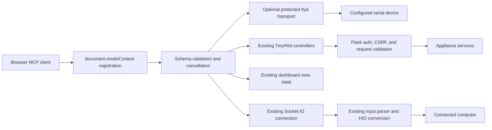

# TinyPilot WebMCP

TinyPilot's dashboard exposes its major operations as browser-native WebMCP
tools. Shared tools cover Community; optional adapters discover real controllers
on an installed Pro dashboard. The tools use the page's existing authenticated session, video frame, and
device controls. They register during initial dashboard startup. TinyPilot adds
no agent UI, task runner, approval queue, or pause/stop controls.

This integration uses the browser's `document.modelContext.registerTool` API.
It is not a separately hosted MCP server. Older `navigator.modelContext`
implementations are supported as a compatibility fallback. Browsers without
WebMCP retain the normal dashboard; the adapter records unavailability in the
browser console.

## Architecture



The tool layer does not introduce an unauthenticated backend, a generic shell
tool, or a new credential store. Registration is filtered by the current page's
permissions. The backend remains responsible for authorization even after a tool
has been registered. Account changes refresh the page where appropriate so the
tool list can follow the new session.

| Source                                                                       | Responsibility                                                                                    |
| ---------------------------------------------------------------------------- | ------------------------------------------------------------------------------------------------- |
| [webmcp-tools.js](../app/static/js/webmcp-tools.js)                          | Tool names, schemas, limits, role filtering, and application operations                           |
| [webmcp.js](../app/static/js/webmcp.js)                                      | Browser registration, cancellation, result handling, and target/view adapters                     |
| [controllers.js](../app/static/js/controllers.js)                            | Existing authenticated HTTP operations, with abort signals carried through requests               |
| [api.py](../app/api.py)                                                      | Existing Flask role checks, CSRF protection, request validation, settings, and service operations |
| [socket_api.py](../app/socket_api.py)                                        | Existing authenticated keyboard/mouse handlers and device acknowledgments                         |
| [index.html](../app/templates/index.html), [app.js](../app/static/js/app.js) | Page context and initialization alongside the ordinary dashboard                                  |

OpenAI currently discovers imperative tools in the top-level page, not tools
inside iframes or declarative HTML forms. Use the latest supported desktop app
and model when testing. [OpenAI site tools documentation](https://learn.chatgpt.com/docs/webmcp)

The optional implementation is in
[webmcp-pro-tools.js](../app/static/js/webmcp-pro-tools.js). It includes no
licensed controller code: it calls exports already present on the installed
edition. [webmcp-serial.js](../app/static/js/webmcp-serial.js) implements the
public ttyd protocol and exposes lifecycle hooks for stop and page disposal.

## Tool and dashboard coverage

The final source catalogs produce the following counts, verified directly
against the Community exports and the audited Pro 3.0.2 controller names:

| Session                                        | Community | Pro with protected serial transport |
| ---------------------------------------------- | --------: | ----------------------------------: |
| Signed-in administrator                        |        38 |                                  77 |
| Authentication disabled (administrator access) |        36 |                                  75 |
| Signed-in operator                             |        15 |                                  31 |

Pro adds 34 administrator tools or 11 operator tools, plus five serial transport
tools when explicitly enabled. Without the serial deployment gate, subtract
five from each Pro total. File upload, image creation, and opening a serial
window additionally require the corresponding browser adapters.
`change_my_password` and `logout` are omitted without a signed-in account.
These are source-catalog counts; successful native browser registration is a
separate check made through the browser inventory.

Tools that change device or target state carry the WebMCP
destructive hint; read-only tools carry the read-only hint. The browser MCP host
applies its invocation policy. Security-changing tools require HTTPS. Password
and license inputs are marked write-only in their schemas and are never logged
or returned. File transfers use the browser file picker and therefore require
browser user activation.

### Observe and control the attached computer

| Dashboard capability                             | WebMCP tool              | Contract / distinction                                                                                                                                                                                     |
| ------------------------------------------------ | ------------------------ | ---------------------------------------------------------------------------------------------------------------------------------------------------------------------------------------------------------- |
| Connection and display status; installed version | `get_tinypilot_status`   | Reads current connection/view context, permissions, version, demo status, and unavailable features. Does not infer the target operating system.                                                            |
| Help → About and open-source credits             | `get_about`              | Reads installed version and bundled licensing metadata; excludes the Pro license key.                                                                                                                      |
| Screenshot                                       | `capture_screen`         | Captures the currently rendered video/image frame as JPEG content, includes dimensions/time, The ordinary Screenshot link remains available for a downloaded snapshot.                                     |
| Paste text                                       | `type_text`              | Sends up to 10,000 characters using the existing paste endpoint. Accepts `en-US`, `en-GB`, and `de-DE`. This types into the current target focus; a newline can submit a form or command on a real target. |
| Physical/on-screen keys and modifier chords      | `send_key`               | Uses physical key codes for letters, digits, punctuation, F1–F12, navigation/editing keys, numpad, and modifiers. Accepts Control, Shift, Alt, and Meta modifiers; releases afterward.                     |
| Built-in system shortcuts                        | `send_keyboard_shortcut` | Ctrl+Alt+Delete, Ctrl+Alt+Backspace, Meta+Alt+Escape, and Alt+Tab. The effect belongs to the target OS.                                                                                                    |
| Move pointer                                     | `move_pointer`           | Uses current-screen coordinates normalized to 0–1 on each axis.                                                                                                                                            |
| Click and double-click                           | `click_pointer`          | Left, right, middle, back, and forward buttons; one or two clicks; releases afterward.                                                                                                                     |
| Hold-and-drag                                    | `drag_pointer`           | Bounded left-button drag from one normalized point to another; always attempts button release.                                                                                                             |
| Vertical and horizontal scroll                   | `scroll_target`          | Up, down, left, or right; 1–20 wheel steps at a normalized location.                                                                                                                                       |
| Release held inputs                              | `release_input`          | Releases keyboard and pointer state.                                                                                                                                                                       |

The existing [remote-screen component](../app/templates/custom-elements/remote-screen.html)
continues to support direct mouse, keyboard, touchscreen taps, and mobile input.
Touch gestures are alternate human input methods for the same target actions.
The tool interface exposes the resulting key/pointer operations rather than
fabricating a touchscreen gesture stream.

### View and video

| Dashboard capability                                   | WebMCP tool            | Contract / distinction                                                                                                                                                        |
| ------------------------------------------------------ | ---------------------- | ----------------------------------------------------------------------------------------------------------------------------------------------------------------------------- |
| Cursor, on-screen keyboard, key history, paste masking | `set_view_preferences` | Cursor: default, none, crosshair, dot, pointer. Optional booleans control the keyboard, key history, and paste mask. Updates shared view preferences.                         |
| Fullscreen / dedicated window                          | `request_display_mode` | Requires browser user activation.                                                                                                                                             |
| Exit fullscreen                                        | `set_view_preferences` | Set `fullscreen: false`; entering fullscreen uses the display tool.                                                                                                           |
| Read video settings and reset defaults                 | `get_video_settings`   | Admin. Returns current values and their defaults. To reset a value, pass its returned default to `set_video_settings`.                                                        |
| Codec and quality settings                             | `set_video_settings`   | Admin. Reads current values, merges supplied fields, saves, requests video-service restart, then reads settings back. MJPEG 1–30 fps and quality 1–100; H.264 50–20,000 kbps. |
| Advanced H.264 STUN settings                           | `set_video_settings`   | Server and port are paired. Set both to `null` to disable; use a hostname/IP and port for a configured server. The UI's named presets are concrete server/port choices.       |

Applying video settings can interrupt the picture. A saved value and an
acknowledged restart request do not prove the encoder restarted successfully;
verify the live stream. The tool supports the controls implemented by this
checkout, with actual codec availability still determined by the appliance.

### Appliance networking

All networking tools require administrator access.

| Dashboard capability           | WebMCP tool           | Contract / distinction                                                                                                                   |
| ------------------------------ | --------------------- | ---------------------------------------------------------------------------------------------------------------------------------------- |
| Inspect interfaces             | `get_network_status`  | Returns connection state, IP and MAC addresses.                                                                                          |
| Inspect configured Wi-Fi       | `get_wifi_settings`   | Returns network name and country, never the password.                                                                                    |
| Save secured Wi-Fi credentials | `configure_wifi`      | Password is a write-only argument and is never logged. May disconnect access.                                                            |
| Save an open Wi-Fi network     | `configure_open_wifi` | Explicitly sends no password, matching the dashboard's blank-password flow. Warns that traffic may be exposed and access may disconnect. |
| Remove Wi-Fi credentials       | `forget_wifi`         | Removes the saved network and password.                                                                                                  |
| Read hostname                  | `get_hostname`        | Returns the appliance's current hostname.                                                                                                |
| Change hostname and restart    | `change_hostname`     | Matches the dashboard's change-and-restart flow. Returns a suggested new `.local` address; reconnection must be verified.                |

### Accounts and security

| Dashboard capability               | WebMCP tool                   | Contract / distinction                                                                                                                                                 |
| ---------------------------------- | ----------------------------- | ---------------------------------------------------------------------------------------------------------------------------------------------------------------------- |
| Read HTTPS requirement             | `get_https_requirement`       | Admin; reads current policy.                                                                                                                                           |
| Enable/disable HTTPS requirement   | `set_https_requirement`       | Admin; secure context. Disabling allows unencrypted device access.                                                                                                     |
| List users and current account     | `list_users`                  | Admin; no credentials returned.                                                                                                                                        |
| Add a user / enable authentication | `add_user`                    | Admin; secure context. Community creates ADMIN accounts; Pro supports ADMIN or OPERATOR. The password is a write-only input. The first account enables authentication. |
| Replace a user's password          | `set_user_password`           | Admin; secure context. Uses the existing admin password endpoint.                                                                                                      |
| Change own password                | `change_my_password`          | Signed-in account; secure context. Server determines the user from the session.                                                                                        |
| Remove a user                      | `remove_user`                 | Admin; secure context. Existing last-user/current-user constraints remain enforced.                                                                                    |
| Disable authentication             | `disable_user_authentication` | Admin; secure context. Deletes every account, matching the dashboard's authentication-disable behavior.                                                                |
| Sign out                           | `logout`                      | Signed-in account. Ends the session and refreshes the page.                                                                                                            |

The login form, credential recovery instructions, and credential entry remain
normal human-facing flows. Tools are registered on the dashboard after access
has been established. No login tool asks the agent to acquire credentials from
another site or session. Operator permissions already understood by the backend
are honored when filtering tools, even though Community's account-creation UI
and tool create administrator accounts.

### Diagnostics, updates, and appliance power

All tools in this table require administrator access.

| Dashboard capability            | WebMCP tool             | Contract / distinction                                                                                                                                           |
| ------------------------------- | ----------------------- | ---------------------------------------------------------------------------------------------------------------------------------------------------------------- |
| Read diagnostic logs            | `get_diagnostic_logs`   | Redacts TinyPilot's sensitive markers and returns a bounded tail, default 12,000 characters, configurable 1,000–30,000. Logs are annotated as untrusted content. |
| Generate a shareable log URL    | `share_diagnostic_logs` | Uploads redacted logs to `logs.tinypilotkvm.com` and returns its URL. This is an external transmission.                                                          |
| Check installed/latest versions | `check_for_updates`     | Reads the installed version and latest release metadata.                                                                                                         |
| Read update state/error         | `get_update_status`     | Reports the existing asynchronous updater status.                                                                                                                |
| Start installation              | `start_update`          | Starts the updater; poll then restart after successful completion. Pro requires the exact advertised version and observes its license/update policy.             |
| Restart TinyPilot               | `restart_tinypilot`     | Restarts the appliance, which interrupts remote access.                                                                                                          |
| Shut down TinyPilot             | `shutdown_tinypilot`    | Shuts down the appliance; powering it back on can require physical access.                                                                                       |

These power operations affect **TinyPilot itself**, not the connected computer.
The target computer can receive ordinary keyboard commands, but this checkout
does not expose an independent target power relay or ATX switch.

### Controls retained in the ordinary UI

The [menu](../app/templates/custom-elements/menu-bar.html) and
[event handlers](../app/static/js/app.js) retain the following controls without a
separate registered tool:

| Control                                                                | How to use it / why it is distinct                                                                                                            |
| ---------------------------------------------------------------------- | --------------------------------------------------------------------------------------------------------------------------------------------- |
| Full Screen / Dedicated Window menu                                    | Retained alongside `request_display_mode`. The tool requests the same browser presentation through a real person click.                       |
| New window lifecycle                                                   | A new page discovers its own tools; leaving a page disposes its registry and closes its serial connection.                                    |
| Source, privacy policy, external information links                     | Ordinary informational links. `get_about` also exposes installed version and bundled open-source credits.                                     |
| GitHub, upgrade, changelog links                                       | Ordinary navigation links; no appliance operation to expose.                                                                                  |
| Show unredacted logs                                                   | The human Logs dialog retains its visibility toggle. WebMCP log tools always apply sensitive-marker redaction.                                |
| Download/copy/share UI affordances                                     | Screenshot and log-sharing tools produce artifacts/URLs; the existing browser download and clipboard controls remain available to the person. |
| Menu/dialog open, close, input visibility toggles, and form validation | Retained as UI affordances. Named tools carry out their substantive operations directly.                                                      |

The integration covers substantive device operations and browser presentation
while preserving human supervision. It does not claim every clickable link has
become a tool.

## Optional Pro dashboard tools

Community's menu entries for Virtual Media, Wake on LAN, Serial Console, SSH,
Static IP, and Tailscale open an upgrade dialog. The licensed implementation is
absent from this public repository. On Pro, each adapter checks for its actual
controller exports before registration. No callable stub returns invented
success for unavailable features. Contracts were checked against the installed
Pro 3.0.2 source through read-only inspection.

| Pro capability                            | Tools                                                                                                   | Contract / access                                                                                                                                                                                              |
| ----------------------------------------- | ------------------------------------------------------------------------------------------------------- | -------------------------------------------------------------------------------------------------------------------------------------------------------------------------------------------------------------- |
| Media inventory and progress              | `list_virtual_media`                                                                                    | Admin. Stored/intermediate files, mounted state, sizes and mode; up to 100 entries of each kind.                                                                                                               |
| Download stored image                     | `get_virtual_media_download`                                                                            | Admin. Verifies the file exists, then returns its authenticated same-origin download path; no image contents returned to the MCP client.                                                                       |
| Mount / eject / delete or cancel transfer | `mount_virtual_media`, `eject_virtual_media`, `delete_virtual_media`                                    | Admin. CDROM, FLASH_READ_ONLY, FLASH_READ_WRITE. Deletion can cancel an intermediate transfer.                                                                                                                 |
| Import from URL                           | Human-only dashboard flow                                                                               | TinyPilot Pro 3.0.2 does not sufficiently constrain its server-side URL requests. WebMCP registration is withheld until the backend blocks private, loopback, link-local, redirect, and DNS-rebinding targets. |
| Upload local image                        | `upload_virtual_media`                                                                                  | Admin. The person picks one File. No host-path arguments or implicit local-file access.                                                                                                                        |
| Build image from local files              | `create_virtual_media_from_files`                                                                       | Admin. The person selects 1–100 files to package in the named image; does not mount it.                                                                                                                        |
| Disk space                                | `get_disk_usage`                                                                                        | Admin. Total/used/free bytes on the appliance.                                                                                                                                                                 |
| Installed scripts                         | `list_user_scripts`, `run_user_script`                                                                  | Operator. Running is marked destructive and a fresh exact match in the installed list. No code, arguments, or script upload accepted.                                                                          |
| SSH access                                | `get_ssh_status`, `set_ssh_enabled`                                                                     | Admin. State includes default-credential flag and public host fingerprint. Access changes are marked destructive and a secure context.                                                                         |
| Wake-on-LAN                               | `get_wake_on_lan_target`, `set_wake_on_lan_target`, `forget_wake_on_lan_target`, `send_wake_on_lan`     | Operator; mutations are marked destructive. Saving a MAC does not send a packet; sending does not prove target boot.                                                                                           |
| Static IPv4                               | `get_static_ip`, `try_static_ip`, `persist_static_ip`, `clear_static_ip`                                | Admin; mutations are marked destructive. Trial and persistence remain separate, preserving the device's 60-second verification window.                                                                         |
| Tailscale                                 | `get_tailscale_status`, `install_tailscale`, `start_tailscale`, `stop_tailscale`, `uninstall_tailscale` | Admin; mutations are marked destructive. Authentication links remain in the human dashboard.                                                                                                                   |
| Serial discovery/settings                 | `list_serial_devices`, `get_serial_settings`, `get_serial_defaults`, `configure_serial_connection`      | Operator; configuration is marked destructive and a currently discovered ttyACM/ttyUSB port.                                                                                                                   |
| Open existing serial window               | `open_serial_console`                                                                                   | Operator; Requires browser activation for the existing console page.                                                                                                                                           |
| Pro license                               | `get_pro_license_status`, `attach_pro_license`, `detach_pro_license`                                    | Admin. Key never returned; missing license reported explicitly. Mutations are marked destructive and a secure context. The license key is a write-only input.                                                  |
| Account role                              | `set_user_role`                                                                                         | Admin; secure context. ADMIN/OPERATOR, with backend self-demotion constraints.                                                                                                                                 |

Relative mouse mode, two-factor authentication, and Automation License
management are not present in the audited controller set. They remain
unavailable. Status derives feature availability from controller exports rather
than assuming all Pro installations have identical capabilities.

### Protected serial transport

The five serial transport tools are separately gated by
`context.serialToolsEnabled === true`, an HTTPS origin, and real serial
controllers. The private device package sets that flag only together with the
nginx authentication patch. Importing this module or listing/reading its tools
does not open a serial connection.

| Tool                        | Behavior                                                                                                                                                                                                                              |
| --------------------------- | ------------------------------------------------------------------------------------------------------------------------------------------------------------------------------------------------------------------------------------- |
| `connect_serial_console`    | Rechecks normal controller authorization and current device discovery, fetches the protected token, then connects to fixed same-origin `wss://…/ttyd/ws` using subprotocol `tty`. The handshake starts the configured serial wrapper. |
| `read_serial_console`       | Reads up to 12,000 characters from a 65,536-character transcript. UTF-8 decoding spans frames, terminal control payloads are filtered, and output is marked untrusted. No implicit connection or input.                               |
| `write_serial_console`      | Sends at most 4,096 characters. Rejects GNU screen's Ctrl-A command prefix. Reports queued bytes, not target execution.                                                                                                               |
| `resize_serial_console`     | Sends bounded terminal dimensions, separately from text input.                                                                                                                                                                        |
| `disconnect_serial_console` | Closes this page's ttyd connection and its wrapped serial-client process.                                                                                                                                                             |

Page disposal closes the serial connection; it never reconnects implicitly.
Backpressure bounds pending sends. Tokens stay in the internal
handshake and are never returned. Transport readiness does not prove the serial
device accepted a command; inspect output and verify the target separately.
The transcript is not a full terminal-screen emulator.

The wire contract follows the primary ttyd 1.7.7
[protocol definitions](https://github.com/tsl0922/ttyd/blob/1.7.7/src/server.h),
[client handshake/input implementation](https://github.com/tsl0922/ttyd/blob/1.7.7/html/src/components/terminal/xterm/index.ts),
and [server lifecycle](https://github.com/tsl0922/ttyd/blob/1.7.7/src/protocol.c).
No proprietary TinyPilot serial implementation is copied into these adapters.

## Deploying to an existing device

The physical Pro 3.0.2 dashboard is not interchangeable with this Community
checkout. Preserve its `/new` variant/banner, licensed menus, role controls,
virtual-media preferences, and update licensing flow. Its
`getLatestRelease(gkParams)` and `update(version)` signatures differ from
Community; the shared tools select the correct existing controller contract.
All other controller changes must preserve existing callers and exports.

[build-webmcp-device-package](../dev-scripts/build-webmcp-device-package) builds a
reviewable local pack from audited original files. It verifies hashes, retains
originals, and produces additive patched files and backup/rollback checks. The
builder never contacts or changes a device. The generated pack includes licensed
originals for local review; do not publish that pack as public entrant source.
Re-audit after firmware or dashboard-version changes instead of forcing a
mismatched patch. Official updates can overwrite direct dashboard modifications.

Read-only inspection found ttyd `1.7.7-40e79c7`, launched with the configured
serial wrapper and GNU screen. The existing `/ttyd/ws` nginx location lacked the
`/auth` check present on `/ttyd`. The package adds `auth_request /auth` and its
auth-status forwarding before enabling serial tools, validates nginx, and retains
a rollback copy. This requirement is a server authorization boundary, not a
client-side permission flag. No physical serial connection was opened during
the source/protocol audit or mock transport tests.

## Safety and completion semantics

- Tool schemas reject extra properties, malformed types, out-of-range values,
  and unsupported enum values before side effects. Backend parsers validate again.
- Browser cancellation signals reach HTTP requests, input acknowledgments, and
  the optional serial transport.
- Registration and tool calls log only counts, tool names, status, and duration.
  Arguments, results, passwords, license keys, typed text, and screen contents
  are not logged by the WebMCP adapter.
- Password and license-key fields are explicit write-only schema properties.
  The normal authenticated backend remains responsible for authorization.
- Direct keyboard, paste, and pointer tools act when the browser MCP host invokes
  them. The browser host applies its own invocation policy using the supplied
  read-only, destructive, and untrusted-content annotations.
- Leaving the page aborts its registration lifetime, releases held input, closes
  its page-scoped serial connection, and unregisters tools when supported.

## Run the isolated demo

From the repository root, use Python 3.11+ and the supported Node runtime for this
checkout. Node 22 is a suitable runtime for the pinned Mocha toolchain.

```sh
python3 -m venv venv
venv/bin/python3 -m pip install -r requirements.txt
npm ci
venv/bin/python3 dev-scripts/serve-webmcp-demo --port 8000
```

Open `http://127.0.0.1:8000/` in a WebMCP-capable browser. Each browser session
receives a private TinyDesk micro desktop backed by a few kilobytes of in-memory
state. Its desktop shell includes Notes, Calculator, Minesweeper, and live Input
Activity. Type text, perform calculations, reveal or flag Minesweeper tiles,
move/click the pointer, and save a note with Ctrl+S. Reset my demo computer
clears only the caller's state. Typed text is never evaluated or executed.

This launcher creates a fresh temporary `TINYPILOT_HOME_DIR` and applies the
normal SQLite migrations there. It uses the real application, controllers,
Flask authentication/CSRF, request parsers, and Socket.IO handlers. Hardware
effects are replaced at the service/HID boundary. It does **not** replace or
shim the browser's WebMCP provider.

The visible label and response headers identify the demo. Video is escaped SVG
refreshed by demo-only JavaScript; `capture_screen` converts the rendered frame
to JPEG. H.264 values can be stored but the demo does not run an encoder, Janus,
or STUN. Accounts, video preferences, Wi-Fi, hostname, updates, power, HTTPS
preference, and diagnostics use session-private sample state. Network status is
the checkout's debug fixture.

The demo fences physical HID writes, process launches, and outbound server
connections. Its CSP also limits browser connections to the same origin, so
external diagnostic-log uploading is intentionally unavailable in the demo.
Passwords supplied for simulated accounts or Wi-Fi are validated and discarded.
The process keeps at most 128 least-recently-used micro desktops, so memory use
is bounded. The debugger and reloader are disabled. All demo data disappears
when the process exits.

An external bind requires `--username` and a password provided through
`TINYPILOT_DEMO_PASSWORD` (or an environment variable selected with
`--password-env`). Use an HTTPS reverse proxy when deploying the demo for remote
browser access. Run one application replica because the demo session state is
process-local. This launcher is an isolated demonstration server, not the
production TinyPilot deployment procedure.

### Cloudflare Containers

The `cloudflare/` deployment runs the same demo image as one `lite` Cloudflare
Container behind a Worker. It forwards WebSockets, sleeps after ten inactive
minutes, and uses the provider's HTTPS `workers.dev` hostname. Configure
`TINYPILOT_DEMO_PASSWORD` and a 32-byte `TINYPILOT_DEMO_FLASK_SECRET` as Worker
secrets before opening the public URL. The stable Flask secret preserves signed
login cookies if the ephemeral container restarts; TinyDesk contents remain
deliberately temporary.

```sh
cd cloudflare
npm ci
npx wrangler secret put TINYPILOT_DEMO_PASSWORD
npx wrangler secret put TINYPILOT_DEMO_FLASK_SECRET
npm run deploy
```

## Verification

Run the focused integration and contract checks:

```sh
venv/bin/python3 dev-scripts/serve-webmcp-demo --self-test
npm run test:webmcp
node_modules/.bin/eslint app/static/js/webmcp*.js
```

The demo self-test exercises real HTTP and Socket.IO handlers, CSRF rejection,
account simulation/login/logout, two-browser state separation, bounded session
eviction, unauthenticated denial, input conversion, SVG
escaping, sample service changes, and the installed external-effect fence. The
JavaScript tests inject providers/controllers to check schemas, argument routing,
permissions, cancellation, release behavior, and registration failures.
The Pro adapter tests also cover real-file selection boundaries, unavailable
features, installed-script allowlisting, argument ordering, missing licenses,
and secret omission. Serial protocol tests cover authorization failures, secure
origin gating, split UTF-8/control sequences, bounded buffers, queueing,
backpressure, abort, timeout, and lifecycle cleanup. These fixtures never open a
physical serial port and are not native-browser or attached-hardware proof.

For browser verification, open the app in the supported browser, inspect its
native Site tools inventory, and invoke tools through that native surface. Check
the target after calls. Demonstrate typing/capture, view changes, and a readback. Repeat on an actual device before
claiming physical input, networking, encoder, or power behavior.

| Proof layer                                      | Status recorded for this change                                                                                                                                                                                                                                                                                                                                                                  |
| ------------------------------------------------ | ------------------------------------------------------------------------------------------------------------------------------------------------------------------------------------------------------------------------------------------------------------------------------------------------------------------------------------------------------------------------------------------------ |
| Source catalog and role filtering                | Directly counted: Community 38/36/15; Pro with protected serial 77/75/31, for signed-in admin/authentication-disabled admin/signed-in operator.                                                                                                                                                                                                                                                  |
| Isolated demo self-test                          | Passed during implementation. Re-run on the final checkout.                                                                                                                                                                                                                                                                                                                                      |
| Demo JavaScript syntax/style                     | Passed syntax, Prettier, and ESLint during implementation.                                                                                                                                                                                                                                                                                                                                       |
| Live demo HTTP/Socket.IO runtime                 | Started on localhost; inspected successful requests and clean logs after the macOS scheduler fix.                                                                                                                                                                                                                                                                                                |
| Native browser discovery and execution           | Chrome 152 discovered 75 unique tools through `document.modelContext` on the authentication-disabled Pro appliance, with zero registration errors. Native read-only status, about, and disconnected-serial calls passed. Shared input, capture, and view behavior was separately verified against the isolated demo.                                                                             |
| Physical TinyPilot / attached computer           | Installed directly into Pro 3.0.2 after exact source-hash checks. The package modified five existing files and added four WebMCP modules; the previous panel file was removed and the original menu restored. TinyPilot and nginx restarted active; nginx passed validation. No physical HID, serial connection, network, account, update, or power mutation was invoked during this correction. |
| Public live app, video, and challenge submission | Separate outstanding publishing/submission steps; see [WEBMCP-CHALLENGE.md](WEBMCP-CHALLENGE.md).                                                                                                                                                                                                                                                                                                |

The isolated demo uses native Python threading rather than importing TinyPilot's
eventlet scheduler. This avoids an observed macOS Python 3.9 kqueue conflict
under Werkzeug while leaving the production runtime unchanged.
